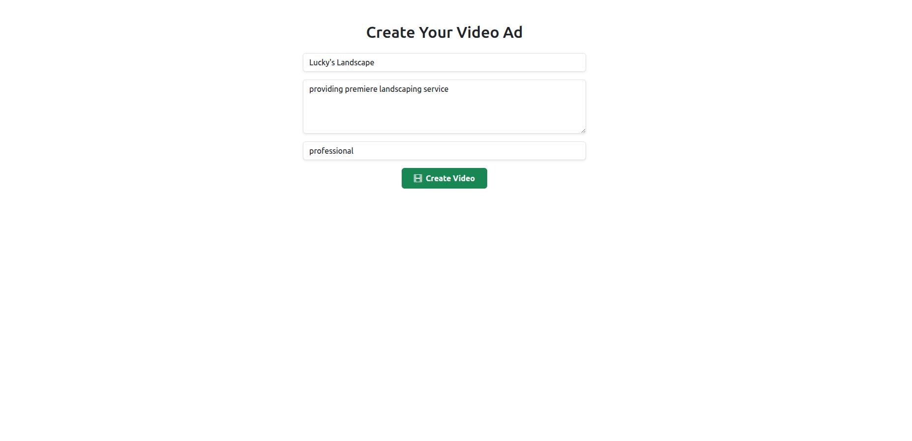
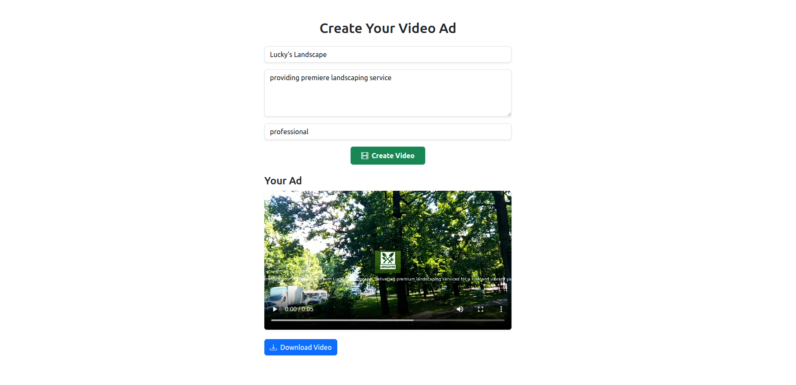
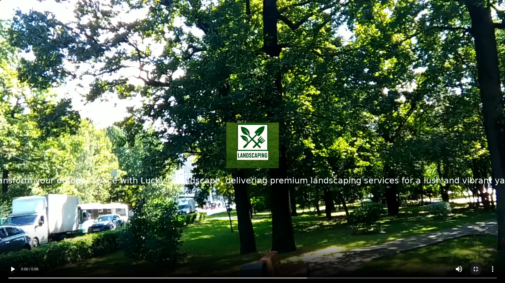

# AdGen Video

AdGen Video is a full-stack AI-powered application that generates short marketing videos based on user-provided product descriptions, tones, and messages. 
It leverages the Groq API (llama3 LLM) to craft ad copy and FFmpeg to render simple video ads with captions. However, code can easily be modified to utilize
Open AI for more robust solution. Designed to be fast, intuitive, and portable via Docker.

## Features

- Generate short-form video ads from structured inputs
- Use AI to write ad messages automatically
- Render videos with FFmpeg including text overlays
- Real-time video preview and download
- Mobile-responsive, Bootstrap-styled frontend
- Easy to run locally using Docker or Node.js

---

## Tech Stack

**Frontend:**
- React
- Axios
- Bootstrap 5

**Backend:**
- Node.js
- Express
- FFmpeg
- Groq API
- Open API ** not used due to cost

**DevOps:**
- Docker
- Docker Compose

---

## Demo

### Screenshots

#### This is the initial screen where users enter their product name, tone, and message.

#### System renders new video with text and logo overlay. Text is generated from groq api and llama LLM. 

### Video

---

## Getting Started

### Prerequisites

- [Docker & Docker Compose](https://docs.docker.com/compose/) (recommended)
- Or: [Node.js](https://nodejs.org/) v16+ if running manually

---

### Run with Docker

1. Clone the repository:

    git clone https://github.com/axbisme/adgen-video.git

    cd adgen-video

2. Start the application:

    docker-compose up --build

3. Open your browser:

    Frontend: http://localhost:3000

    Backend API: http://localhost:5000/api/generate

---

### Manual Setup

Backend:

cd server
npm install
npm start

Frontend:

cd client
npm install
npm start

---

### Note
OPENAI_API_KEY=your_openai_key_here
Make sure FFmpeg is installed and available in your system PATH if not using Docker.

---

### Usage
1. Enter your product name, tone, and message
2. Click "Generate"
3. The AI generates a script, FFmpeg renders the video
4. Preview or download your generated ad

---

### Short-Term TODOs (MVP Polish)
- Implement automated testing: Add unit and integration tests using Jest for backend and frontend, plus end-to-end tests with Playwright.

- Input validation and sanitization: Add backend input schema validation using libraries like Joi or zod to prevent injection and malformed prompts.

- Environment-based configuration: Introduce dotenv-based config switching (e.g., development, production).

- Video progress/loading indicator: Improve UX by showing percent-complete or progress bar during video generation.

- Drag-and-drop UI polish: Replace or enhance static input fields with more dynamic interaction, such as drag-and-drop tone presets or example templates.

### Long-Term TODOs (Production Ready)
- Deploy to cloud infrastructure: Deploy to AWS (e.g., ECS + S3 for video storage) with CI/CD pipelines.

- Replace local video storage: Move from local file system to cloud storage like Amazon S3 or Cloudflare R2, with signed URLs for downloads.

- Auth + user profiles: Add authentication (e.g., Firebase or Auth0) to support saving past videos, editing drafts, and usage limits.

- AI script tuning: Use prompt engineering or fine-tuned models to support multiple ad styles (e.g., TikTok, YouTube, corporate, etc.).

- Template system: Build a reusable component or JSON-driven video layout system for multiple branded templates.

---

### License
This project is open source and licensed under the MIT License.
 
 