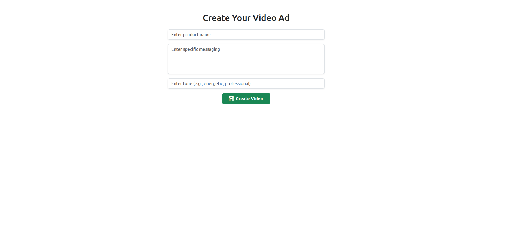
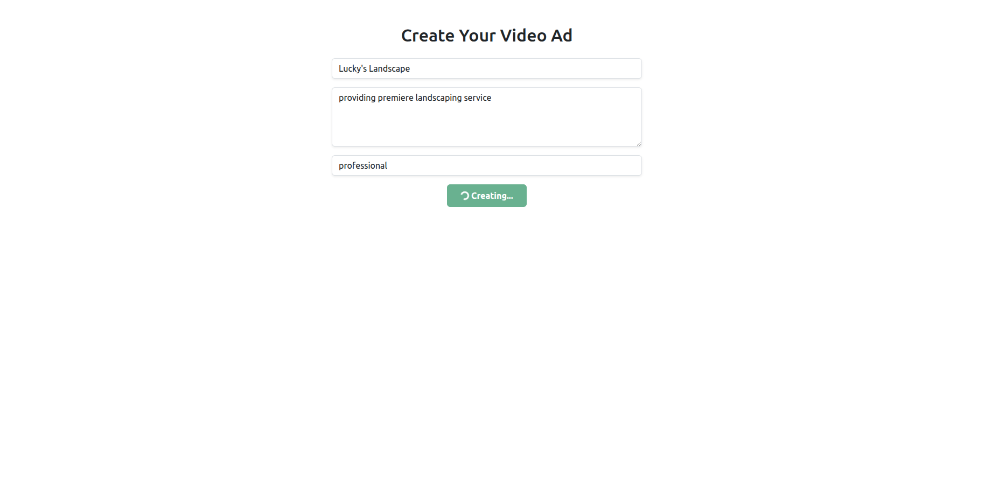

# AdGen Video

AdGen Video is a full-stack AI-powered application that generates short marketing videos based on user-provided product descriptions, tones, and messages. 
It leverages the Groq API (llama3 LLM) to craft ad copy and FFmpeg to render simple video ads with captions. However, code can easily be modified to utilize
Open AI for more robust solution. Designed to be fast, intuitive, and portable via Docker.

## Features

- Generate short-form video ads from structured inputs
- Use AI to write ad messages automatically
- Render videos with FFmpeg including text overlays
- Real-time video preview and download
- Mobile-responsive, Bootstrap-styled frontend
- Easy to run locally using Docker or Node.js

---

## Tech Stack

**Frontend:**
- React
- Axios
- Bootstrap 5

**Backend:**
- Node.js
- Express
- FFmpeg
- Groq API
- Open API ** not used due to cost

**DevOps:**
- Docker
- Docker Compose

---

## Getting Started

### Prerequisites

- [Docker & Docker Compose](https://docs.docker.com/compose/) (recommended)
- Or: [Node.js](https://nodejs.org/) v16+ if running manually

---

### Run with Docker

1. Clone the repository:

    git clone https://github.com/axbisme/adgen-video.git

    cd adgen-video

2. Start the application:

    docker-compose up --build

3. Open your browser:

    Frontend: http://localhost:3000

    Backend API: http://localhost:5000/api/generate

### Manual Setup

Backend:

cd server
npm install
npm start

Frontend:

cd client
npm install
npm start

### Note
OPENAI_API_KEY=your_openai_key_here
Make sure FFmpeg is installed and available in your system PATH if not using Docker.

### Usage
1. Enter your product name, tone, and message
2. Click "Generate"
3. The AI generates a script, FFmpeg renders the video
4. Preview or download your generated ad

### License
This project is open source and licensed under the MIT License.

## Demo

### Screenshots

#### This is the initial screen where users enter their product name, tone, and message.

#### System renders new video with text and logo overlay. Text is generated from groq api and llama LLM. 

### Video
